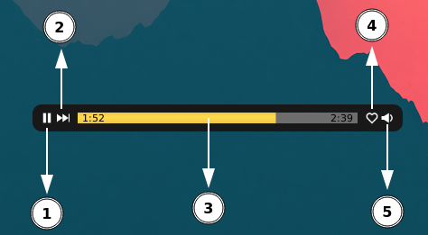

# Yandex Music Wave Player

1. [Вступление](#вступление)
2. [Требования](#требования)
3. [Возможности](#возможности)
4. [Установка и запуск](#установка-и-запуск)
    - [Первый запуск](#первый-запуск)
5. [Файл конфигурации](#файл-конфигурации)
    - [Background](#background)
    - [Bar](#bar)
    - [Duration](#duration)
    - [Position](#position)
    - [Title](#title)
    - [User](#user)
    - [Volume](#volume)
6. [Элементы управления](#элементы-управления)
7. [Контекстное меню](#контекстное-меню)
8. [В разработке](#в-разработке)
9. [Известные проблемы](#известные-проблемы)

---

## Вступление

JavaFX приложение для прослушивания треков из "Моей Волны" Яндекс Музыки.
Работает на базе [Yandex Music API](https://yandex-music.readthedocs.io/en/main/).


---

## Требования

* [JDK 17+](https://www.oracle.com/cis/java/technologies/downloads/#java17)
* [Gradle 8.5+](https://gradle.org/install/)(Будет скачан автоматически во время сборки.)
* [ffmpeg](https://github.com/FFmpeg/FFmpeg?tab=readme-ov-file#libraries)

---

## Возможности

* Пауза/Воспроизведение трека;
* Переключение трека;
* Регулирование громкости;
* Добавление/Удаление трека в/из "Мне нравится";
* Получение ссылки на скачивание трека;
* Получение полного названия трека, включая исполнителей;
* Изменение внешнего вида плеера;
* Изменение расположения плеера;
* Конфигурация параметров при помощи YAML файла.

---

## Установка и запуск

Склонировать репозиторий:

```
git clone https://github.com/madnessday666/yandex-music-wave-player.git
```

Перейти в директорию с проектом:

```
cd yandex-music-wave-player
```

Собрать образ с помощью gradle и плагина Jlink:

```
./gradlew jlink
```

После завершения файлы приложения будут находится в build/image.
Переместите их в более удобное место, например:

```
cp -R build/image ~/player
```

Последующие запуски выполнять при помощи файла yandex-music-wave-player в директории bin:

```
cd ~/player/bin

./yandex-music-wave-player
```

### Первый запуск

Программа попросит ввести API токен. [Способы получения токена](https://yandex-music.readthedocs.io/en/main/token.html).


После отправки токена появится окно плеера. Стандартное расположение плеера на экране - середина (но это не точно).

---

## Файл конфигурации

**При первом запуске будет создан конфигурационный файл config.yaml в директории $HOME/.config/ymwp/**

При последующих запусках он будет использован для установки параметров в приложении.

Структура файла:

<pre>
!!ymwp.model.config.ConfigFile
background:
  color: '#181818'
  opacity: 1.0
  radius: 20
bar:
  bgColor: '#6d6d6d'
  color: '#ffdb4d'
  opacity: 1.0
duration:
  color: '#000'
  fontFamily: System
  fontSize: 11
  opacity: 1.0
  paddingLeft: 5
  paddingRight: 5
position:
  x: 768
  y: 360
title:
  color: '#f4f4f4'
  fontFamily: System
  fontSize: 14
  opacity: 1.0
user:
  id: $YOUR_USER_ID
  token: $YOUR_TOKEN
volume: 0.6
</pre>

### Background

Параметры фона плеера.

<table>
<thead>
  <tr>
    <th align="center">Параметр</th>
    <th align="center">Тип</th>
    <th align="center">Диапазон</th>
    <th align="center">Пример</th>
  </tr>
</thead>
<tbody>
  <tr>
    <td align="center"><code>color</code></td>
    <td align="center"><code>String</code></td>
    <td align="center"><code>-</code></td>
    <td>
      <pre>
background:
  color: '#181818'
...</pre>
      
      <pre>
background:
  color: peru
...</pre>
      
      <pre>
background: 
  color: 'linear-gradient(to left, 
      #F55765 0%, 
      #395666 50%, 
      #105163 100%)'
...</pre>
      
    </td>
  </tr>
  <tr>
    <td align="center"><code>opacity</code></td>
    <td align="center"><code>Double</code></td>
    <td align="center"><code>0.0...1.0</code></td>
    <td>
      <pre>
background:
  color: white
  opacity: 0.2
...</pre>
      
    </td>
  </tr>
  <tr>
    <td align="center"><code>radius</code></td>
    <td align="center"><code>Integer</code></td>
    <td align="center"><code>0...999</code></td>
    <td>
      <pre>
background:
  radius: 0
...</pre>
      
      <pre>
background:
  radius: 40
...</pre>
      
    </td>
  </tr>
</tbody>
</table>

### Bar

Параметры индикатора проигрывания трека.

<table>
<thead>
  <tr>
    <th align="center">Параметр</th>
    <th align="center">Тип</th>
    <th align="center">Диапазон</th>
    <th align="center">Пример</th>
  </tr>
</thead>
<tbody>
  <tr>
    <td align="center"><code>bgColor</code></td>
    <td align="center"><code>String</code></td>
    <td align="center"><a href="https://docs.oracle.com/javase/8/javafx/api/javafx/scene/paint/Color.html#field.summary">См. здесь</a></td>
    <td>
      <pre>
...
bar:
  bgColor: '#6d6d6d'
...</pre>
        
        <pre>
...
bar:
  bgColor: moccasin
...</pre>
        
    </td>
  </tr>
  <tr>
    <td align="center"><code>color</code></td>
    <td align="center"><code>String</code></td>
    <td align="center"><a href="https://docs.oracle.com/javase/8/javafx/api/javafx/scene/paint/Color.html#field.summary">См. здесь</a></td>
    <td>
      <pre>
...
bar:
  bgColor: '#6d6d6d'
  color: '#ffdb4d'
...</pre>
      
      <pre>
...
bar:
  bgColor: moccasin
  color: aqua
...</pre>
      
    </td>
  </tr>
  <tr>
    <td align="center"><code>opacity</code></td>
    <td align="center"><code>Double</code></td>
    <td align="center"><code>0.0...1.0</code></td>
    <td>
      <pre>
background:
  color: rosybrown 
  opacity: 1.0 
  radius: 20 
bar: 
  bgColor: steelblue 
  color: yellow 
  opacity: 0.3
...</pre>
      
    </td>
  </tr>
</tbody>
</table>

### Duration

Параметры меток длительности трека.

<table>
<thead>
  <tr>
    <th align="center">Параметр</th>
    <th align="center">Тип</th>
    <th align="center">Диапазон</th>
    <th align="center">Пример</th>
  </tr>
</thead>
<tbody>
  <tr>
    <td align="center"><code>color</code></td>
    <td align="center"><code>String</code></td>
    <td align="center"><code>-</code></td>
    <td>
      <pre>
...
duration:
  color: '#ffffff' 
...</pre>
      
      <pre>
...
duration:
  color: 'linear-gradient(to left, 
      #f83921 0%, 
      #b89d31 50%, 
      #c12345 100%)'
...</pre>
      
    </td>
  </tr>
  <tr>
    <td align="center"><code>fontFamily</code></td>
    <td align="center"><code>String</code></td>
    <td align="center"><code>-</code></td>
    <td>
      <pre>
...
duration:
  fontFamily: scientifica
...</pre>
      
    </td>
  </tr>
  <tr>
    <td align="center"><code>fontSize</code></td>
    <td align="center"><code>Integer</code></td>
    <td align="center"><code>0...999</code></td>
    <td>
      <pre>
...
duration:
  fontSize: 8
...</pre>
      
    </td>
  </tr>
  <tr>
    <td align="center"><pre>
paddingLeft 
paddingRight</pre></td>
    <td align="center"><code>Integer</code></td>
    <td align="center"><code>0...999</code></td>
    <td>
      <pre>
...
duration:
  paddingLeft: 5
  paddingRight: 20
...</pre>
      
    </td>
  </tr>
  <tr>
    <td align="center"><code>opacity</code></td>
    <td align="center"><code>Double</code></td>
    <td align="center"><code>0.0...1.0</code></td>
    <td>
      <pre>
...
duration:
  color: red
  opacity: 0.3
...</pre>
      
    </td>
  </tr>
</tbody>
</table>

### Position

Параметры расположения плеера.

<table>
<thead>
  <tr>
    <th align="center">Параметр</th>
    <th align="center">Тип</th>
    <th align="center">Диапазон</th>
    <th align="center">Пример</th>
    <th align="center">Примечание</th>
  </tr>
</thead>
<tbody>
  <tr>
    <td align="center"><code>x</code></td>
    <td align="center"><code>Integer</code></td>
    <td align="center"><code>screen resolution</code></td>
    <td>
      <pre>
...
position:
  x: 320
...</pre></td>
    <td align="center"><code>Отступ от левого края экрана</code></td>
  </tr>
  <tr>
    <td align="center"><code>y</code></td>
    <td align="center"><code>Integer</code></td>
    <td align="center"><code>screen resolution</code></td>
    <td>
      <pre>
...
position:
  y: 5
...</pre>
   </td>
    <td align="center"><code>Отступ от верхнего края экрана</code></td>
  </tr>
</tbody>
</table>

### Title

Параметры метки исполнителя и названия трека.

<table>
<thead>
  <tr>
    <th align="center">Параметр</th>
    <th align="center">Тип</th>
    <th align="center">Диапазон</th>
    <th align="center">Пример</th>
  </tr>
</thead>
<tbody>
  <tr>
    <td align="center"><code>color</code></td>
    <td align="center"><code>String</code></td>
    <td align="center"><code>-</code></td>
    <td>
      <pre>
...
title:
  color: plum
...</pre>
      
      <pre>
...
title:
  color: 'linear-gradient(to left, 
      #00ffff 0%, 
      #dda0dd 50%, 
      #ffffff 100%)'
...</pre>
      
    </td>
  </tr>
  <tr>
    <td align="center"><code>fontFamily</code></td>
    <td align="center"><code>String</code></td>
    <td align="center"><code>-</code></td>
    <td>
      <pre>
...
title:
  fontFamily: Serif
...</pre>
      
    </td>
  </tr>
  <tr>
    <td align="center"><code>fontSize</code></td>
    <td align="center"><code>Integer</code></td>
    <td align="center"><code>0...999</code></td>
    <td>
      <pre>
...
title:
  fontSize: 8
...</pre>
      
    </td>
  </tr>
  <tr>
    <td align="center"><code>opacity</code></td>
    <td align="center"><code>Double</code></td>
    <td align="center"><code>0.0...1.0</code></td>
    <td>
      <pre>
...
title:
  color: chartreuse 
  opacity: 0.3
...</pre>
      
    </td>
  </tr>
</tbody>
</table>

### User

Параметры пользователя.

**Не рекомендуется изменять вручную.**

<table>
<thead>
  <tr>
    <th align="center">Параметр</th>
    <th align="center">Тип</th>
    <th align="center">Диапазон</th>
    <th align="center">Пример</th>
  </tr>
</thead>
<tbody>
  <tr>
    <td align="center"><code>id</code></td>
    <td align="center"><code>Long</code></td>
    <td align="center">-</td>
    <td>
      <pre>
...
user:
  id: 123456789 
...</pre>
    </td>
  </tr>
  <tr>
    <td align="center"><code>token</code></td>
    <td align="center"><code>String</code></td>
    <td align="center">-</td>
    <td>
      <pre>
...
user:
  token: y0_AAAAAAAAAAAAAAAAAAAAAAAAAAAAAAAAAAAAAAAAAAAAAAAAAAAAAAA
...</pre>            
    </td>
  </tr>
</tbody>
</table>

### Volume

Параметры начальной громкости плеера.

<table>
<thead>
  <tr>
    <th align="center">Параметр</th>
    <th align="center">Тип</th>
    <th align="center">Диапазон</th>
    <th align="center">Пример</th>
  </tr>
</thead>
<tbody>
  <tr>
    <td align="center"><code>volume</code></td>
    <td align="center"><code>Double</code></td>
    <td align="center"><code>0.0...1.0</code></td>
    <td>
      <pre>
...
volume: 0.3</pre>
    </td>
  </tr>
</tbody>
</table>

## Элементы управления



Описание элементов управления:

1. Воспроизведение/Пауза.
2. Переключение трека.
3. Индикатор проигрывания. При нажатии изменяет текущее время проигрывания.
4. Добавить/Убрать трек в/из "Мне нравится".
5. Управление громкостью. При нажатии включает/отключает звук. При прокручивании колеса мыши - изменение уровня
   громкости.

## Контекстное меню

Вызов контекстного меню осуществляется по нажатию правой кнопкой мыши в крайней правой/левой области плеера, включая
область с элементами управления.


Описание пунктов меню:

* _Copy title_ - Скопировать название трека, включая исполнителей.
* _Copy link_ - Скопировать ссылку на скачивание трека.
* _Logout_ - Удаление данных пользователя и вызов окна авторизации.
* _Exit_ - Завершение работы программы.

## В разработке

* Возможность изменения размера плеера (на данный момент имеет фикс. значения высоты: 30px и ширины: 410px).
* Возможность изменения цветов элементов управления.

## Известные проблемы

* Периодические повторы треков.
